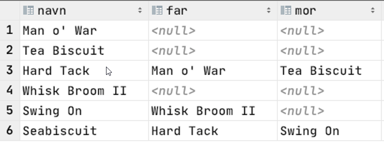
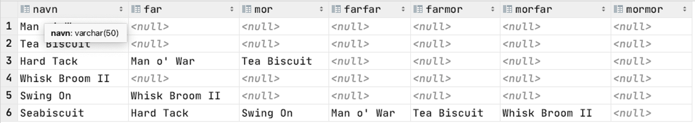

# MySQL Intro

## 1. Install MySQL

In the pptx for the Database intro there are slides that explain how to install MySQL and MySQL Workbench. Use that to install MySQL Server and MySQL Workbench.

---

## 2. Run some SQL-Queries

1. Fetch all data from the city table.
1. Fetch all data from Sweden (CountryCode="SWE") in the city table.
1. Fetch the CityName and Population for Sweden in the city table.
1. Get the number of countries there is in the database (schema), have a look at the closing slides from the lecture.
1. Sum the total of people registered in the world database (schema) and call the column for WorldPopulation.
1. Sum how many people there is in Asia.
1. Make a rising ranked list of all countries and their area size, sorted by area. (Try to figure out which columns and tables that are needed)
1. Make a ranked list of countries by declining life expectancy and rising population
1. Make a list of countries by number of people per square kilometer. (Hint: Look for a table containing population and km2 to get started. Use mathematical operators in the query.)
1. List country code, name and independence year, sorted by year and thereafter name, for all the countries that have a independence year. (Hint: something with NULL).

---

## 3. Run some more SQL-Queries

1. Fetch all countries that have 'W' in their country code.
1. Fetch all countries that the name starts with 'N', 'O' or 'P'. Sort them by name.
1. Retrieve all language data for countries that have an official language spoken by 99% or more of the country's population. Sort by descending percentage, then alphabetically by language.
1. Retrieve country code, name and continent for all countries in America (both North America and South America). Sort alphabetically by country code.
1. Retrieve the number of countries per continent for all continents.
1. Get the continent and the number of countries in this continent, for those continents that have 30 or more countries. Sort by number of countries in descending order.
1. Summarizes what the total population per continent (ie for all continents) is, sorted by population (descending order).
1. Double check the answer from the problem above by summing the numbers per continent by hand (for example with Windows calculator), and then compare them with a new query that retrieves the sum of the world's population.

---

## 4. SQL CRUD

For the first eight exercises, create a new database/schema named test and set it to default schema in MySQL Workbench.

### 1. Create a table person. The table should contain the following:

- Personnummer char(12), may not be null and must be unique.
- FirstName varchar(100), should have the default value 'okänt'
- LastName varchar(100), should have the default value 'Okäntsson'
- Epost varchar(255), should be unique

Create the table and make sure it exists by refreshing the view and the type in the editor: `DESC person`

### 2. Add a person to the table person with the following data:

- Personnummer: 123456789012
- FirstName: Kalle
- LastName: Kula
- Epost: kalle@kula.se

Write a query to check that the person is in the table.

### 3. Birthdays

You realize that it would be nice to add the birthdate as a DATE. Modify the table so it have another column named FodelseDag of the type Date.

Check that table has been changed like in previous task.

### 4. Add more data

Adda new row in the table person. The following data should be specified.

- Personnummer: 210987654321

Write a query to check that the data is saved as a row in the table.

### 5. Update a row

Update the row with personnummer 210987654321 so that the FodelseDag column gets the value '1990-01-01'. Note: Date columns in MySQL will be formatted internally by MySQL as 'YYYY-MM-DD'.

### 6. Me, myself and I

Add yourself to the person table, Fill out all the fields (You don't have to use your real data if you dont want to.)

### 7. Lets copy our table (not really)

Add a new table named personCopy. (You don't have to copy the data, just the structure.) Check that the table exists with a suiting command. When you see it's there, remove it with a suiting command.

### 8. **WATCH OUT** Using a built in function

If we extract the name and DOB from the person table, the date on MySQL will come out as an ISO-format (YYYY-MM-DD). Convert the output so it is in the format (MM-DD-YYYY, us-format?).

> Hint: google the DATE_FORMAT() function in MySQL.

Update the FodelseDag value for Kalle Kula so the birth date is 1973.02.01. Enter the birth date in that format, but use the STR_TO_DATE() function so MySQL understands the format of the date.

### 9. Back to the world

Return back to the world database.
In the city table, there is a city named 'Bærum', remove it. (It's not a city and should not be in the city table.)

Write a sql-query that shows that you've managed to remove that row.

---

## 5. SQL Keys

In the following exercises, use the test database we created in earlier exercises.

### 1. Find a friend in the class and discuss and explain the following database termonology between each other.

- Primary key
- Foreign key
- NULL
- Serial Number (AUTO_INCREMENT)

### 2. Alter table

Use alter table to add a column named ID on the table Person. It should be ID, int, auto_increment and be a primary key. Check that everything works by running a suitable query. You should then see that each row has a unique serial number.

### 3. Bad luck

After a while we realize that we hade a little bit of bad luck when we designed the table person since a person only can have one email address.

Create a new table **Email** that fulfills the following criterias.

- Address, varchar(75), may not be null and must be unique.
- Type, varchar(50).
- Person_ID, int may not be null,
  As **primary key** the address column should be used.
  As a **foreign key** Person_ID that references the column ID in the person table.

### 4. Copy and paste

Write a SQL that copies email adresses and ID's from the person table over to **Address** and **Person_ID** in the **Email** table.

### 5. Did you copy paste?

When we finished with the third task, and moved email to it's own table, we can remove the email column from the person-table. We want to remove the whole column, not only the data.

### 6. Remove yourself

Try to remove yourself from the Person table and look if it fails. If it not fails, you have missed something in the earlier steps since it should not be possible to remove a person with an **Address** in the **Email** table since the **Email** table contains a reference to the **Person** table.

Change the **Email** table so it uses the **cascade** constraint when deleting.

Try again to delete yourself from the Person table. This time it should work. Check that you're gone from the person table and also that your email is removed from the **Email** table.

### 7. To the maximum!

Use the max() function and fetch the biggest ID in world.city.

```SQL
SELECT * FROM information_schema.tables
--for the world-database.
WHERE table_schema = 'world'
```

Can you find out how many rows you have in the different tables?  
What is the name of the column that contains this?  
Can you find the column that gives us the next value for city.ID?

---

## 6. SQL Joins

### Task 1. concepts & terminology

Go together in pairs, briefly / simply explain the following terminology and database concepts for each other / together:

- JOIN
- LEFT JOIN
- RIGHT JOIN
- Cartesic productTask
- JOIN, etc.

### Task 2.

Use the MySQL sample database ("schema") called world. (Same as before.)
Write SQL queries that perform the following:

1. Retrieve all cities that begin and end with 'o' (uppercase letter first, lowercase last) and their population. Sort them alphabetically. (Hint: Do you remember wildcards from the past?)

1. Problem 1 gave many exciting city names, but where in the world are these cities located!? We want to include the name of the country in which the cities are located. The country will be listed as a new, first column.  
   The columns will thus be:

- country name,
- city name
- city population.

  We want the answer sorted alphabetically by country, then by city.  
  Problem: Then we have to ask against 2 tables at once! Turn the query from problem 1 into a join query, where we also include the country table, and retrieve the name of the country from this.

  > HINT: You need to find out what is the common column (foreign key to primary key connection) for these two tables.

3. Get out all the countries and their (any) capitals. Sort the result by continent, and then alphabetically by country name.

4. Get an overview of all countries that have at least one city, how many cities they have and the average population in these cities.

5. We want to bring up all the countries in the world, and all their cities, where the population of the country is less than 1000 people. We will see the name of the country, the population in the country, which continent the country belongs to, the name of any cities there, population in any cities there.  
   We want the result sorted alphabetically by the countries' names. (Hint: My answer gives 10 rows out, is the same number of rows you get?)

6. Rank the cities in the world located in a country with some form of monarchical system of government by population. The most populous city first.

7. Get a list of cities in the world that have at least 8,000,000 inhabitants and which continent they belong to. Sort by population, largest first. That is: the city's name, the city's inhabitants and which continent they belong to.

8. Make a query that brings up an overview of the countries in Asia where at least 10 different languages ​​are spoken. The query must retrieve: Name of country, number of languages ​​and this must be sorted decreasing by number of languages.

9. **Difficult**: Create a Horse table and fill in data:

```SQL
create table Hest(
  id int auto_increment primary key,
  navn varchar(50),
  far int default null,
  mor int default null,
  foreign key (mor) references Hest(id) on delete set null,
  foreign key (far) references Hest(id) on delete set null);

  insert into Hest values
  (1, 'Man o'' War', null, null),
  (2, 'Tea Biscuit', null, null),
  (3, 'Hard Tack', 1, 2),
  (4, 'Whisk Broom II', null, null),
  (5, 'Swing On', 4, null),
  (6, 'Seabiscuit', 3, 5);

```

Make a query that retrieves the names of all the horses and the names of their parents.

> Hint: You can join a table with yourself.. Several times..

The result should look like this:  
 

10. **Difficult**: Expand the query to retrieve the grandparents.


